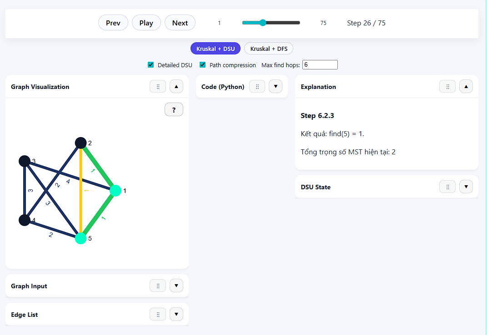
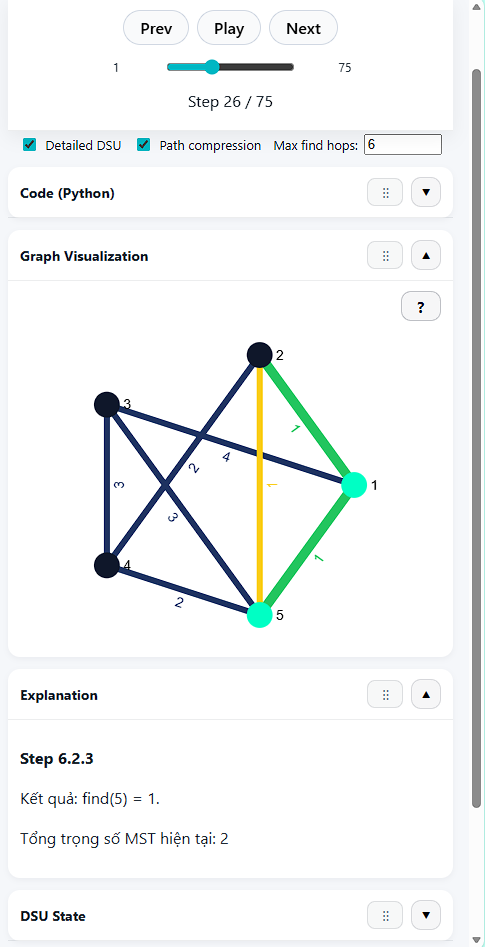
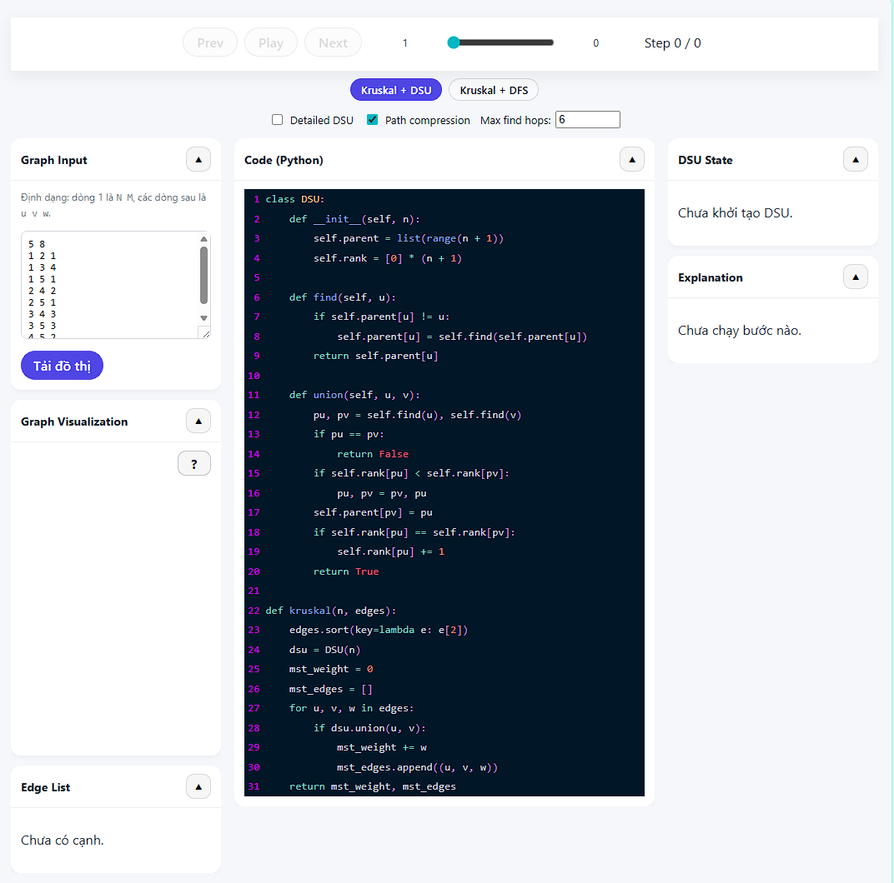
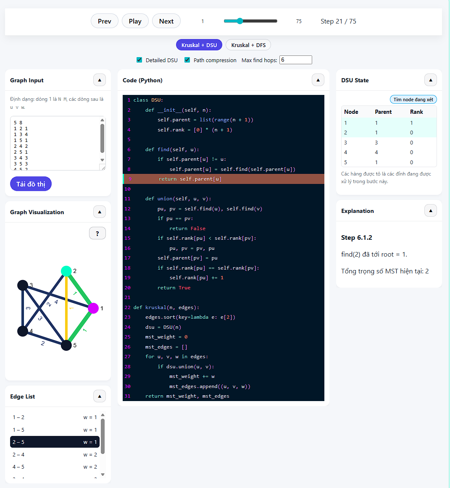
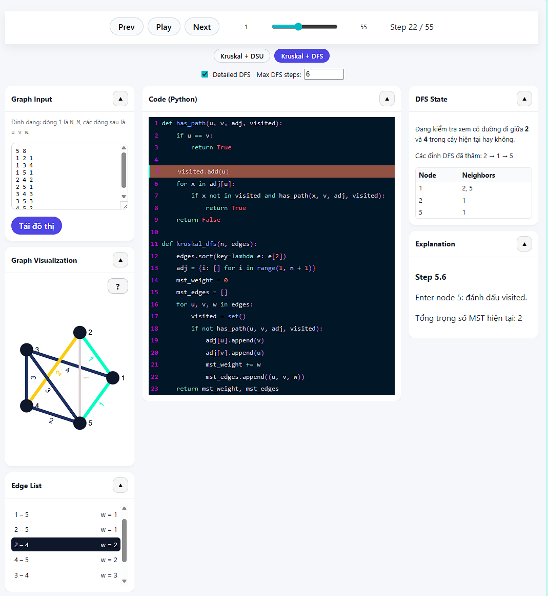
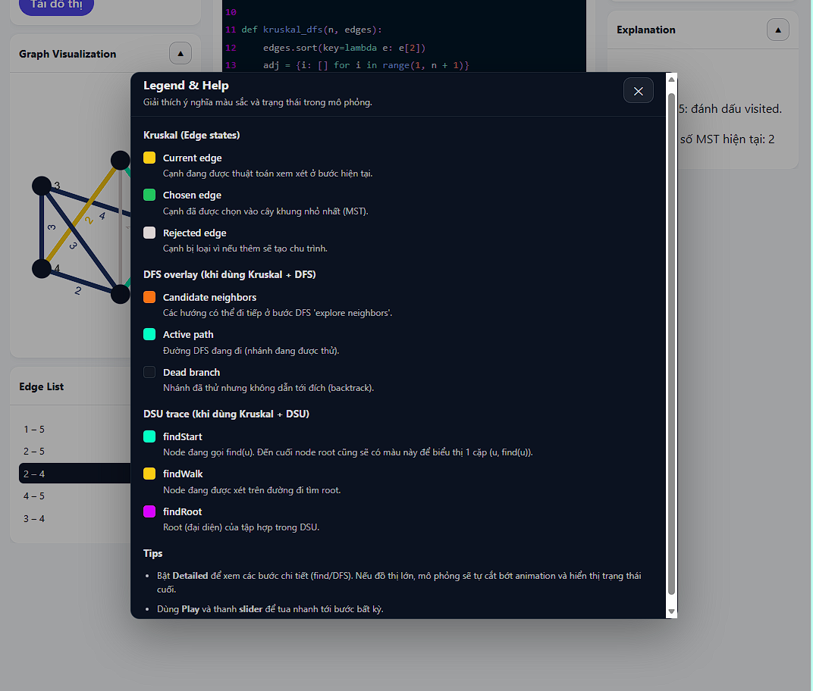
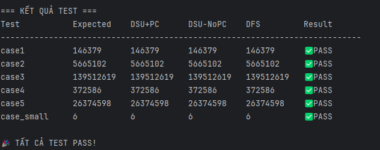

# Kruskal MST Visualizer

[](README.md)

Công cụ trực quan hóa **thuật toán Kruskal tìm cây khung nhỏ nhất (MST)** trên nền web. Đây là công cụ giáo dục giúp sinh viên và lập trình viên hiểu cách thuật toán Kruskal hoạt động từng bước, hỗ trợ cả hai cách phát hiện chu trình: **Disjoint Set Union (DSU)** và **DFS**.

🔗 **Demo trực tuyến:** [https://kruskal-mst-visualizer.vercel.app/](https://kruskal-mst-visualizer.vercel.app/)

---

## ✨ Tính năng

### 🎯 Hai chế độ thuật toán
- **Kruskal + DSU (Union-Find)**: Trực quan hóa cài đặt cổ điển sử dụng Disjoint Set Union với union theo rank và tùy chọn nén đường đi (path compression)
- **Kruskal + DFS**: Minh họa phát hiện chu trình bằng thuật toán tìm kiếm theo chiều sâu trên MST hiện tại

### 📊 Trực quan hóa tương tác
- **Hiển thị đồ thị**: Trực quan hóa đồ thị động bằng [Sigma.js](https://www.sigmajs.org/) và [Graphology](https://graphology.github.io/)
- **Thực thi từng bước**: Di chuyển qua từng bước của thuật toán bằng nút Prev/Next hoặc thanh trượt
- **Chế độ tự động phát**: Xem thuật toán chạy tự động với tốc độ có thể điều chỉnh
- **Tooltip cạnh**: Di chuột qua cạnh để xem thông tin chi tiết (đỉnh đầu, đỉnh cuối, trọng số)

### 🎨 Phản hồi trực quan
- **Trạng thái cạnh**:
  - 🟡 Vàng: Cạnh đang được xem xét
  - 🟢 Xanh lá: Cạnh được chọn vào MST
  - ⚪ Xám: Cạnh bị loại (sẽ tạo chu trình)

- **Trạng thái node DSU** (khi dùng chế độ DSU):
  - 🟢 Xanh ngọc: Node đang gọi `find(u)` / Root tìm được
  - 🟡 Vàng: Node đang được duyệt trong thao tác find
  - 🟣 Tím: Node gốc (root) của tập hợp

- **DFS Overlay** (khi dùng chế độ DFS):
  - 🟠 Cam: Các hàng xóm có thể khám phá tiếp
  - 🟢 Xanh ngọc: Đường DFS đang đi
  - ⚫ Xám: Nhánh đã quay lui (backtracked)

### 🔧 Tùy chọn cấu hình

**Chế độ DSU:**
- Bật **Detailed DSU** để xem từng thao tác find/union chi tiết
- Bật/tắt **Path Compression** để so sánh các cài đặt
- Đặt **Max Find Hops** để giới hạn số step tạo ra cho cây sâu

**Chế độ DFS:**
- Bật **Detailed DFS** để xem từng bước duyệt DFS chi tiết
- Đặt **Max DFS Steps** để giới hạn số step tạo ra cho tìm kiếm phức tạp

### 📱 Thiết kế đáp ứng
- Panel có thể thu gọn phù hợp cho thiết bị di động
- Bố cục thích ứng cho các kích thước màn hình khác nhau
- Điều khiển thân thiện với cảm ứng

### 🖱️ Kéo thả Panel
- **Sắp xếp lại các panel** bằng cách kéo biểu tượng grip (⋮⋮) trên header mỗi panel
- **Desktop (>1024px)**: Kéo panel trong cùng cột của nó (trái, giữa, phải)

- **Mobile/Tablet (≤1024px)**: Kéo tự do bất kỳ panel nào đến bất kỳ vị trí nào trong layout 1 cột

- Tùy chỉnh không gian làm việc để tập trung vào những gì quan trọng nhất với bạn

---

## 📸 Ảnh chụp màn hình

### Giao diện chính
<!-- <Ảnh chụp màn hình hiển thị toàn bộ giao diện với panel đồ thị, code và giải thích> -->


### Chế độ DSU - Nén đường đi
<!-- <Ảnh chụp màn hình hiển thị bảng trạng thái DSU với giá trị parent/rank và các node được tô màu> -->


### Chế độ DFS - Phát hiện chu trình
<!-- <Ảnh chụp màn hình hiển thị duyệt DFS với đường đi đang hoạt động và các node đã thăm được tô màu> -->


### Modal trợ giúp - Chú giải màu sắc
<!-- <Ảnh chụp màn hình modal trợ giúp giải thích tất cả các mã màu và trạng thái> -->


---

## 🚀 Bắt đầu

### Yêu cầu
- Node.js (khuyến nghị v18 trở lên)
- npm hoặc yarn

### Cài đặt

```bash
# Clone repository
git clone https://github.com/Relieq/kruskal-mst-visualizer.git
cd kruskal-mst-visualizer

# Cài đặt dependencies
npm install

# Khởi động server phát triển
npm run dev
```

Ứng dụng sẽ có sẵn tại `http://localhost:5173`

### Build cho Production

```bash
npm run build
npm run preview
```

---

## 📖 Hướng dẫn sử dụng

### 1. Nhập đồ thị
Nhập đồ thị trong panel nhập liệu với định dạng:
```
N M
u1 v1 w1
u2 v2 w2
...
```
Trong đó:
- `N` = số đỉnh
- `M` = số cạnh
- Mỗi dòng cạnh chứa: `u v w` (đỉnh đầu, đỉnh cuối, trọng số)

**Ví dụ:**
```
5 8
1 2 1
1 3 4
1 5 1
2 4 2
2 5 1
3 4 3
3 5 3
4 5 2
```

### 2. Tải đồ thị
Click **"Tải đồ thị"** để trực quan hóa đồ thị của bạn.

### 3. Chọn chế độ thuật toán
Chọn giữa:
- **Kruskal + DSU**: Sử dụng cấu trúc dữ liệu Union-Find
- **Kruskal + DFS**: Sử dụng DFS để phát hiện chu trình

### 4. Điều hướng các bước
- Dùng nút **Prev/Next** để đi từng bước thủ công
- Dùng **thanh trượt** để nhảy đến bất kỳ bước nào
- Click **Play** để phát tự động

### 5. Hiểu trực quan hóa
- Theo dõi **Panel Code** để xem dòng nào đang được thực thi
- Đọc **Panel Giải thích** để hiểu từng bước bằng tiếng Việt
- Kiểm tra **Panel Trạng thái DSU/DFS** để xem trạng thái cấu trúc dữ liệu nội bộ

---

## 🛠️ Công nghệ sử dụng

- **Frontend Framework**: [React 19](https://react.dev/) với TypeScript
- **Build Tool**: [Vite](https://vitejs.dev/) (sử dụng Rolldown)
- **Trực quan hóa đồ thị**: [Sigma.js](https://www.sigmajs.org/) + [Graphology](https://graphology.github.io/)
- **Kéo thả**: [@dnd-kit](https://dndkit.com/) cho tính năng sắp xếp panel
- **Tô sáng code**: [Prism React Renderer](https://github.com/FormidableLabs/prism-react-renderer)
- **Deployment**: [Vercel](https://vercel.com/)
- **Analytics**: [Vercel Speed Insights](https://vercel.com/docs/speed-insights)


---

## 📁 Cấu trúc dự án

```
kruskal-mst-visualizer/
├── src/
│   ├── components/          # Các component React
│   │   ├── CodeViewer.tsx       # Hiển thị code Python với tô sáng
│   │   ├── CollapsiblePanel.tsx # Wrapper thu gọn cho các panel
│   │   ├── ControlPanel.tsx     # Điều khiển phát lại
│   │   ├── DFSPanel.tsx         # Trực quan hóa trạng thái DFS
│   │   ├── DraggablePanel.tsx   # Wrapper kéo thả cho các panel
│   │   ├── DSUPanel.tsx         # Bảng trạng thái DSU
│   │   ├── EdgeListPanel.tsx    # Danh sách cạnh đã sắp xếp
│   │   ├── ExplanationPanel.tsx # Giải thích từng bước
│   │   ├── GraphInput.tsx       # Form nhập đồ thị
│   │   ├── GraphRenderer.tsx    # Trực quan hóa đồ thị Sigma.js
│   │   └── HelpModal.tsx        # Modal chú giải màu sắc
│   ├── engine/              # Cài đặt thuật toán
│   │   ├── kruskalDsu.ts        # Sinh step Kruskal + DSU
│   │   ├── kruskalDfs.ts        # Sinh step Kruskal + DFS
│   │   ├── parser.ts            # Parser nhập đồ thị
│   │   └── types.ts             # Định nghĩa kiểu TypeScript
│   ├── App.tsx              # Component ứng dụng chính
│   ├── App.css              # Styles ứng dụng
│   └── main.tsx             # Entry point
├── scripts/
│   └── test-all.ts          # Script test tự động
├── test-cases/              # Các file input/output test
└── package.json
```

---

## 🧪 Testing

Chạy các test tự động để xác minh tính đúng đắn của thuật toán:

```bash
npx tsx scripts/test-all.ts
```

Lệnh này sẽ chạy thuật toán trên tất cả các test case trong `src/test-cases/` và so sánh output.



---

## 🤝 Đóng góp

Chào đón mọi đóng góp! Bạn có thể:
- Báo lỗi
- Đề xuất tính năng mới
- Gửi pull request

---

## 📄 Giấy phép

Dự án này là mã nguồn mở và có sẵn theo [Giấy phép MIT](LICENSE).

---

## 📝 Báo cáo dự án

Dự án này được phát triển như một phần của học phần **Project I** tại Đại học Bách Khoa Hà Nội. Báo cáo LaTeX đầy đủ có trong file [`kruskal_mst_visualizer_report_en.pdf`](kruskal_mst_visualizer_report_en.pdf).

---

## 🙏 Lời cảm ơn

- Lấy cảm hứng từ nhu cầu cần có công cụ trực quan hóa thuật toán tốt hơn trong giáo dục khoa học máy tính
- Xây dựng bằng công nghệ web hiện đại để đảm bảo khả năng truy cập và hiệu suất
- Cô Nguyễn Khánh Phương - giảng viên hướng dẫn học phần Project I tại Đại học Bách Khoa Hà Nội, người đã hướng dẫn tận 
tình trong quá trình phát triển dự án này.

---

**Được tạo với ❤️ dành cho những người học thuật toán ở khắp nơi**

